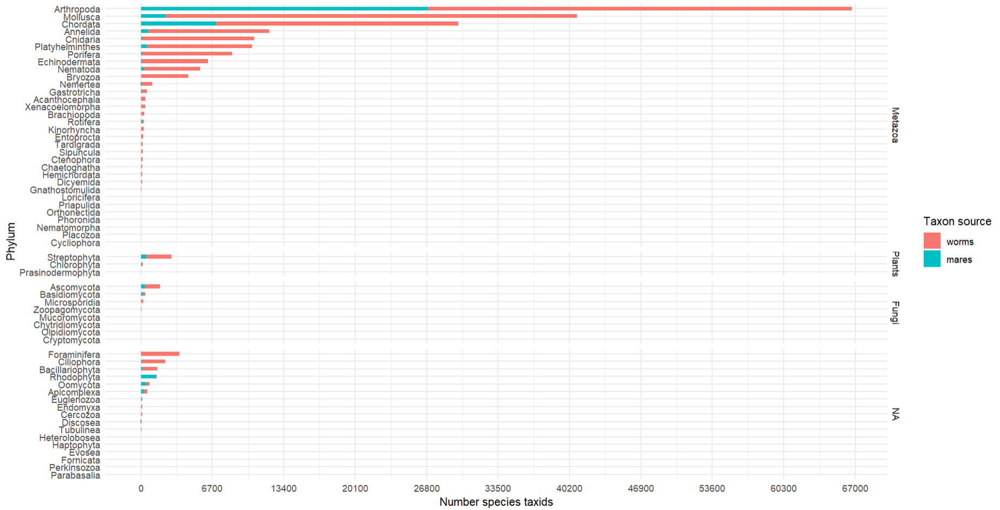
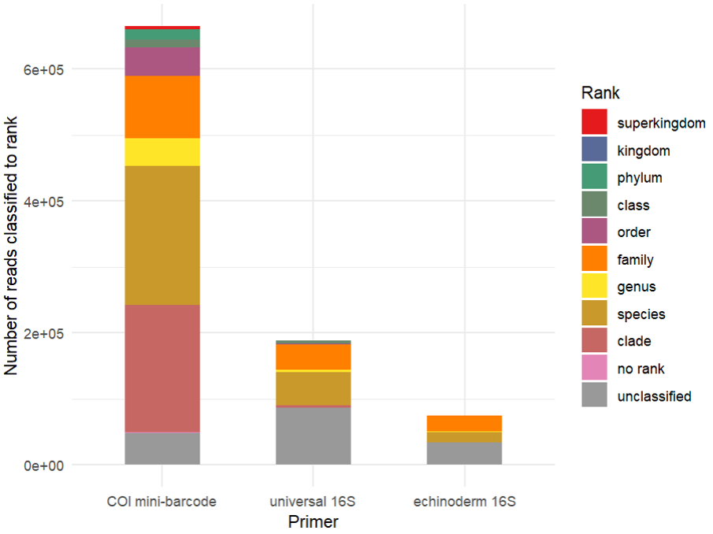
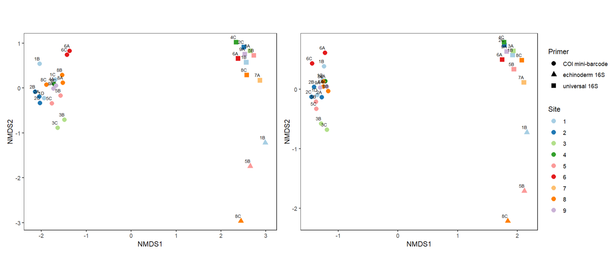
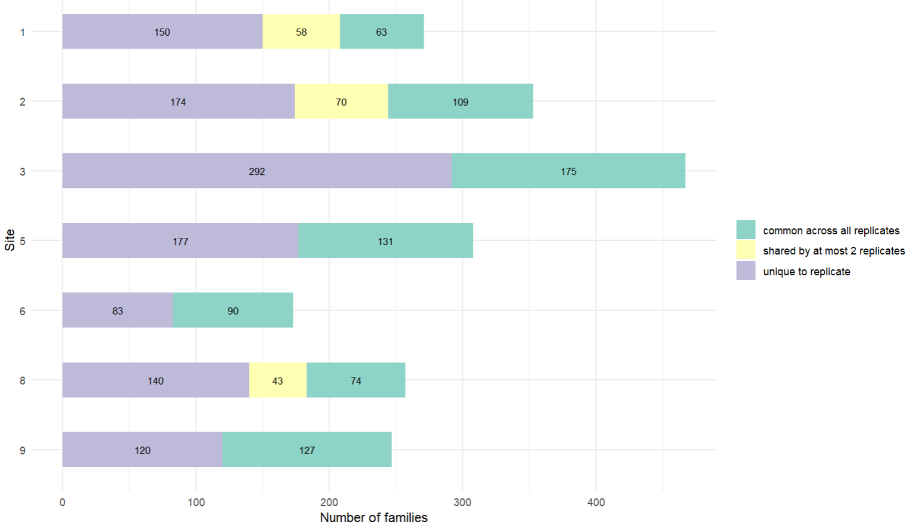
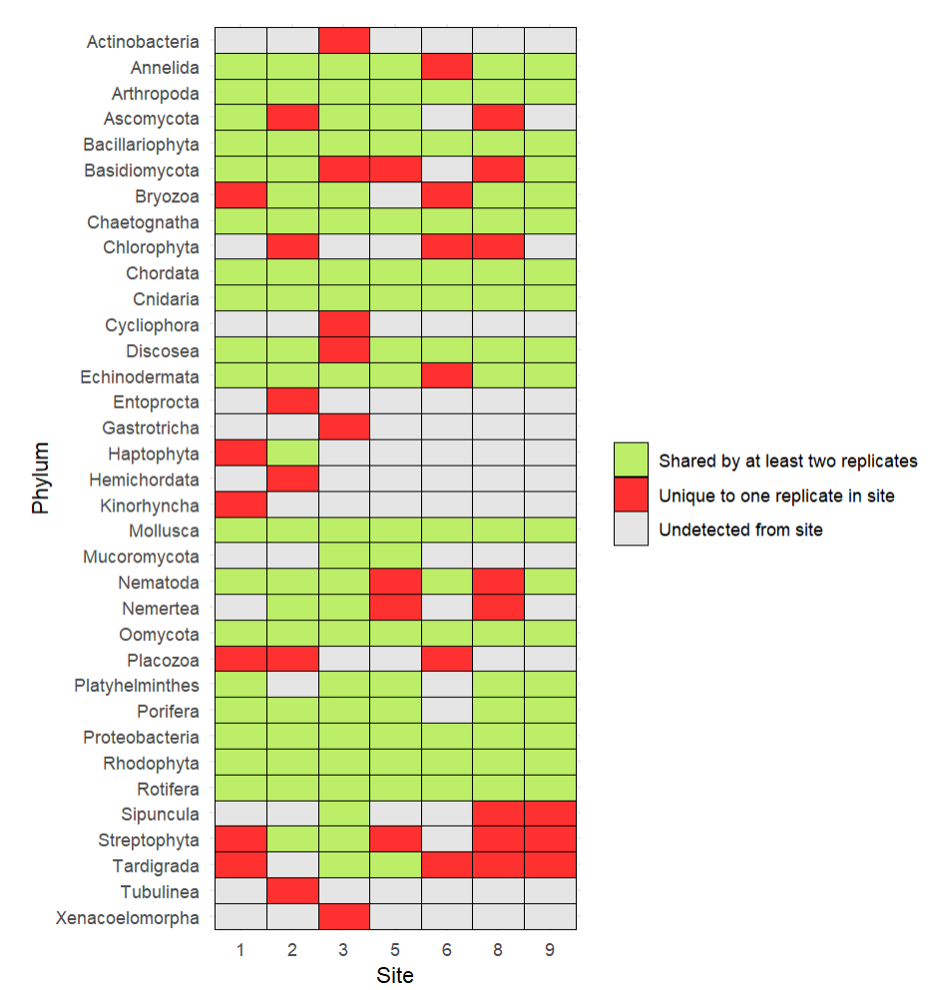
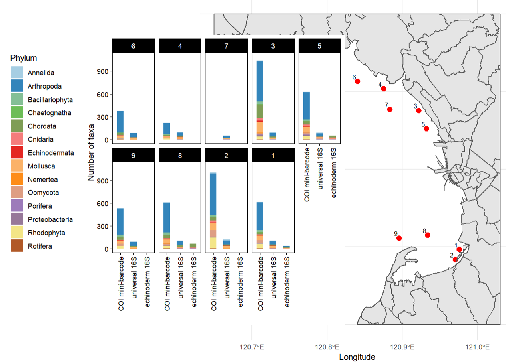
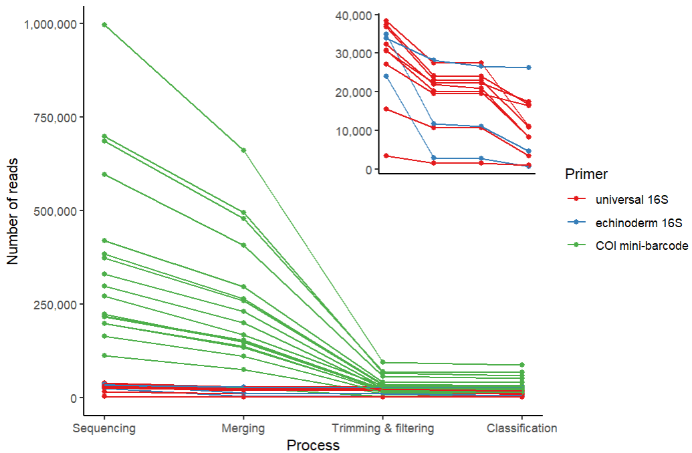

# seq-classification

Scripts for classifying eDNA reads into operational taxonomic units.

1.  Create list of marine taxa using WoRMS dataset
2.  Download COI sequences from GenBank
3.  Download COI sequences from BOLD and find species for which the download has to be repeated due to errors in initial run.
4.  Merge COI sequences from GenBank and BOLD to create one fasta file.

#### Files and directories:

-   bold_download.R
    -   Uses R package bold to download COI sequences from the Barcode of Life Data Systems (BOLD)
-   bold_format.R
    -   Formats sequences downloaded from BOLD to format acceptable to Kraken by attaching taxids from NCBI taxdump
    -   Deduplicates COI and 16S sequences
    -   Check taxids represented in MARES database but absent in compiled WoRMS database
-   gb_parse.R
    -   Creates FASTA files from GenBank flat files
    -   Parses files with multiple GenBank records, extracts seqeunce information, and the COI/16S portion of sequences if mitogenomes are provided
-   kraken_vis.R
    -   Creates long taxonomy table from NCBI taxdump so that taxids can be linked to higher orders of classification
    -   Check coverage of taxa lists from WoRMS and MARES databases
    -   Check coverage of compiled COI and 16S sequence databases to be used for Kraken classification
    -   Compile results of Kraken classification per read
    -   Visualize resolution of Kraken classification
    -   Perform ordinations
    -   Find taxa that are unique, shared, common across replicates
    -   Show phyla detected in map
-   ncbi_download.sh
    -   Cleans taxon list
    -   Downloads GenBank flat files (COI and 16S) from NCBI using Entrez Direct
-   nextera_adapters.R
    -   Generates FASTA file containing NGS adapters to be used for trimming reads
-   ngs.yml and py3.7.yml
    -   YAML files for conda environments used
-   ngs_cleanup.sh
    -   Checks sequence quality of raw reads using fastQC
    -   Summarizes fastQC results with multiQC
    -   Merges, trims, and filters reads
    -   Classifies COI and 16S reads using Kraken
    -   Counts reads remaining after each bioinformatic step
-   read_counts.R
    -   Processes read counts per bioinformatic step to plot data yield
-   taxid_add.sh
    -   Downloads NCBI taxdump
    -   Compiles COI and 16S FASTA files
-   worms_list.R
    -   Creates a list of species using a WoRMS dataset
    -   Extracts taxids in MARES database that are absent in WoRMS
    -   Creates metadata table for taxids in WoRMS and MARES databases

Data visualizations:

------------------------------------------------------------------------

Author's note: Project was started on 2022-07-21 and concluded on 2023-06-29. Latest code edits: 2023-10-18.
